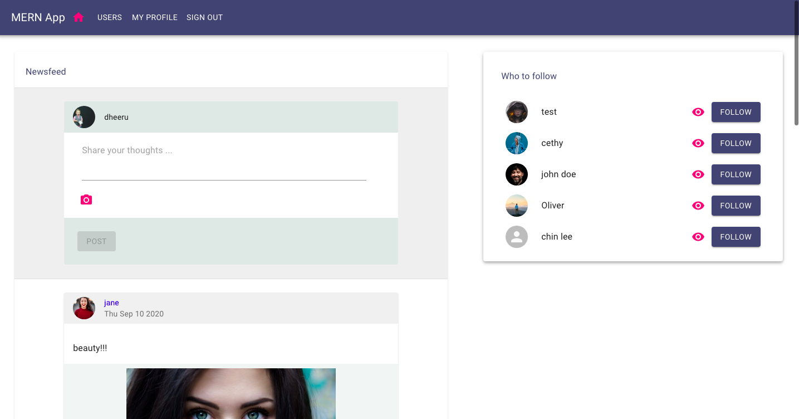

#  Social Media Application 🚀 🚀
Building a Social Madia Application.
# Motivation 
Making a social media application.

# Build status

# Code Style
- Server side code **standard**
- Client side code **PascalCase** 

# Screenshots

# Tech/framework used

- [Node](https://nodejs.org/en/)
- [Express](https://expressjs.com/)
- [Mongo Db](https://www.mongodb.com/)
- [React](https://reactjs.org/)
- [React Router DOM](https://reactrouter.com/web/guides/quick-start)
- [Netlify](https://www.netlify.com/)
- [Heroku](https://www.heroku.com)

# Features
- All CRUD operations 
- user posts
- Comments
- Like
- Follow 
- Unfollow 

# Credits
Facebook , Twitter , Reddit

# License
MIT © Dherendra Dev
